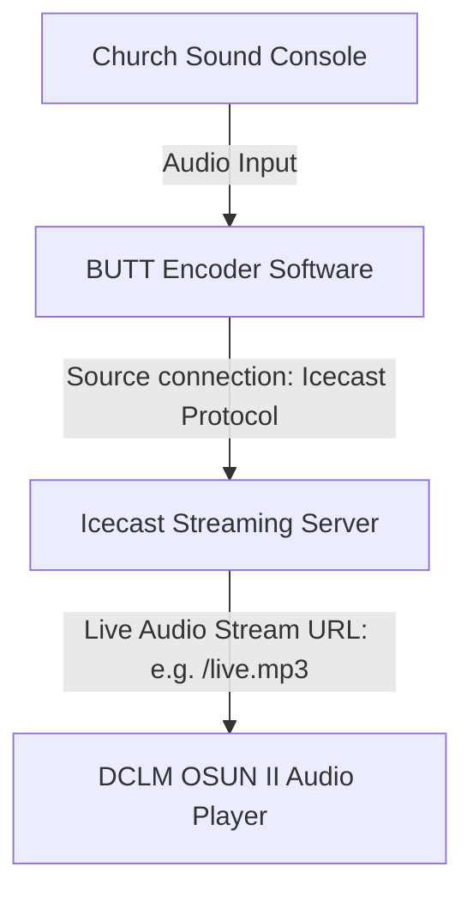

# DCLM OSUN II — Application Analysis, Supabase Migration Plan & Antigravity Project Prompt

This document provides a comprehensive analysis of the existing **DCLM OSUN II** web application, outlines the migration architecture from **Firebase** to **Supabase**, explains the integration of **BUTT audio streaming (Icecast/Shoutcast)**, and provides an optimized prompt to kickstart the new project on Antigravity.

---

## 1. Executive Summary of the App

**DCLM OSUN II** is a rich, single-page gospel fellowship web application designed for the Osun State II region of the Deeper Christian Life Ministry. The app provides a portal for Members, Church Admins, and Guests. 

### Key High-Level Features:
1. **Multi-Role Authentication Gateway**: Supports Guests (read-only/limited access), Members (dashboard access, personal profiles), and Church Admins (system configuration, media management).
2. **Sanctuary Live Video (HLS)**: Supports live streaming of church services using HLS video player feeds.
3. **Synchronized Global Radio & Playlists**: Features a "virtual radio" that plays MP3/AAC streams or synchronizes offline playlist tracks globally across all active listeners using client-server clock synchronization.
4. **Gospel Hymns & Songs (GHS)**: Offline reader for all 260 hymns with lyrics search, category filtering, and instrumental audio playbacks (offline local files with online remote fallbacks).
5. **Holy Bible (KJV Reader)**: Full offline KJV Bible containing book, chapter, and verse grids with adjustable fonts and popups.
6. **Systematic Bible Doctrines**: Dynamic study outline catalog with inline scripture references.
7. **Church Operations & Administration**:
   - **Cell Fellowship Locator**: Map-based or list-based finder for home cell groups.
   - **Workforce Unit Management**: Dynamic department lists, application forms, and real-time announcement boards.
   - **Support Desk & Ticketing**: System for submitting technical issue reports to the media desk.
   - **Giving / Tithe Portal**: Declaring tithes and offering transactions.
   - **Admin Console**: Real-time management of active video streams, announcements, banner slides, and playlists.

---

## 2. Branding, Layout & Design System

The app utilizes a premium dark blue glassmorphism theme, with high-quality visual aesthetics, micro-animations, and responsive layouts.

### Color Palette:
- **Core Background**: Deep Slate Blue (`#102a45` / `#0a1628`)
- **Card Backgrounds**: Semi-transparent dark blue glass with borders (`rgba(255,255,255,0.05)`)
- **Accent Highlight (Green)**: Emerald Green (`#38ef7d`) — represents Members and Active/Online states.
- **Accent Highlight (Blue)**: Light Sky Blue (`#38bdf8` / `#0e5fa3`) — represents buttons, headers, and navigation icons.
- **Accent Highlight (Red)**: Rose/Coral Red (`#f87171` / `#b91c1c`) — represents Admins, stream recording/live badges, and error states.
- **Accent Highlight (Purple)**: Violet (`#a855f7` / `#5b21b6`) — represents Hymns, special features, and overlays.
- **Accent Highlight (Amber)**: Gold (`#f59e0b` / `#fb923c`) — represents warning screens, offline standbys, and chat reactions.
- **Typography & Font Stack**: `-apple-system, BlinkMacSystemFont, "Segoe UI", Roboto, sans-serif`. Heavy font-weights (`700`, `800`) are used for titles and headers to give a solid look.

### UI Layout Components:
- **Auth Overlay Screen**: Custom tab swapper between Create Account and Sign In, with country selector flags, dropdown listings, and hidden admin fields.
- **App Header**: Displays the user's avatar image, a dynamic hourly greeting ("Good morning, Guest", "Good evening, John"), and the DCLM logo.
- **Hero Slider**: Homepage banner carousel for church announcements and flyer promotions.
- **Grid Matrix Options**: Elegant, reactive grid dashboard cards (`RADIO`, `WATCH LIVE`, `LIBRARY`, `DOCTRINE`, `GIVING / TITHE`, `HYMNS / SONGS`).
- **Media Control Bottom Bar**: Persistent audio player bar that appears globally when any audio stream or playlist song is playing.

---

## 3. Database Migration: Firebase to Supabase

The existing Firebase backend relies on **Firebase Anonymous Auth**, **Firestore Database**, and **Firebase Storage** (though avatars/banners are stored as Base64 strings directly inside Firestore). 

To migrate to **Supabase**, we will map the collections to a relational PostgreSQL database and use Supabase Auth and Realtime subscriptions.

### Database Tables (PostgreSQL Schemas)

#### 1. `users` Table
```sql
create table public.users (
  id uuid references auth.users on delete cascade primary key,
  first_name text not null,
  last_name text not null,
  phone text unique not null,
  region text not null,
  group_name text not null,
  profile_image text, -- Storage URL or compressed Base64
  is_admin boolean default false,
  role text default 'member',
  registered_at timestamptz default now()
);
```

#### 2. `admin_codes` Table (Single-use security registration codes)
```sql
create table public.admin_codes (
  id bigint generated by default as identity primary key,
  code text unique not null,
  is_valid boolean default true,
  used_by text, -- Stores Name of Admin who activated it
  used_at timestamptz
);
```

#### 3. `carousel_banners` Table (Homepage promotions)
```sql
create table public.carousel_banners (
  id bigint generated by default as identity primary key,
  image_url text not null,
  title text,
  description text,
  created_at timestamptz default now()
);
```

#### 4. `live_chat_messages` Table
```sql
create table public.live_chat_messages (
  id bigint generated by default as identity primary key,
  user_id uuid references public.users(id) on delete set null,
  username text not null,
  text text not null,
  avatar_url text,
  role text default 'member',
  timestamp timestamptz default now()
);
```

#### 5. `live_reactions` Table (Real-time emoji tracking)
```sql
create table public.live_reactions (
  id bigint generated by default as identity primary key,
  emoji text not null,
  timestamp timestamptz default now()
);
```

#### 6. `radio_presence` Table (Tracks listener count)
```sql
create table public.radio_presence (
  id uuid primary key default gen_random_uuid(),
  user_id uuid references public.users(id) on delete cascade,
  last_seen timestamptz default now()
);
```

#### 7. `radio_tracks` Table (Virtual radio playlists)
```sql
create table public.radio_tracks (
  id bigint generated by default as identity primary key,
  title text not null,
  speaker text not null,
  audio_url text not null,
  duration integer not null, -- Track duration in seconds
  created_at timestamptz default now()
```

#### 8. `video_tracks` Table (Library video streams)
```sql
create table public.video_tracks (
  id bigint generated by default as identity primary key,
  title text not null,
  speaker text not null,
  video_url text not null,
  created_at timestamptz default now()
);
```

#### 9. `library_outlines` Table (Doctrine and PDF material)
```sql
create table public.library_outlines (
  id bigint generated by default as identity primary key,
  title text not null,
  content text not null, -- Markdown/HTML content
  created_at timestamptz default now()
);
```

#### 10. `app_settings` Table (Single record/rows for active feeds)
```sql
create table public.app_settings (
  key text primary key, -- 'live_broadcast', 'radio_broadcast'
  value jsonb not null,  -- e.g., { "streamUrl": "...", "announcement": "..." }
  last_updated timestamptz default now(),
  updated_by text
);
```

#### 11. `workforce_departments` Table
```sql
create table public.workforce_departments (
  id bigint generated by default as identity primary key,
  name text not null,
  description text
);
```

#### 12. `workforce_applications` Table
```sql
create table public.workforce_applications (
  id bigint generated by default as identity primary key,
  user_id uuid references public.users(id) on delete cascade,
  department_id bigint references public.workforce_departments(id) on delete cascade,
  status text default 'pending',
  submitted_at timestamptz default now()
);
```

#### 13. `workforce_unit_messages` Table (Department chat channels)
```sql
create table public.workforce_unit_messages (
  id bigint generated by default as identity primary key,
  department_id bigint references public.workforce_departments(id) on delete cascade,
  user_id uuid references public.users(id) on delete set null,
  username text not null,
  text text not null,
  timestamp timestamptz default now()
);
```

#### 14. `cell_locations` Table
```sql
create table public.cell_locations (
  id bigint generated by default as identity primary key,
  name text not null,
  address text not null,
  leader text not null,
  phone text,
  latitude double precision,
  longitude double precision
);
```

#### 15. `support_tickets` Table
```sql
create table public.support_tickets (
  id bigint generated by default as identity primary key,
  user_id uuid references public.users(id) on delete set null,
  issue_type text not null,
  details text,
  status text default 'open',
  created_at timestamptz default now()
);
```

#### 16. `giving_transactions` Table
```sql
create table public.giving_transactions (
  id bigint generated by default as identity primary key,
  user_id uuid references public.users(id) on delete set null,
  amount numeric not null,
  type text not null,
  status text default 'pending',
  created_at timestamptz default now()
);
```

---

## 4. Audio Streaming & BUTT Software Integration

### How BUTT Software Connects
**BUTT (Broadcast Using This Tool)** is a desktop tool used to capture local audio input (microphones, sound consoles, mixer feeds) and encode it as a continuous audio stream (MP3 or AAC) to an **Icecast** or **Shoutcast** streaming server.



### Playing Icecast Streams in Web Browsers
Icecast streams are progressive HTTP live audio feeds. Playing them requires some specific configurations:
1. **HTML5 `<audio>` Tag Compatibility**: Native `<audio src="https://stream-url/mountpoint"></audio>` works perfectly in all modern web browsers.
2. **Preventing Cache Lock**: Browsers cache HTTP feeds, which might cause old streams to replay when reconnecting. To prevent this, always append a unique timestamp variable to the stream source on load:
   `audioElement.src = streamUrl + '?nocache=' + Date.now();`
3. **Stream Standby / Offline Handling**:
   When the Icecast server mountpoint goes offline (e.g. BUTT disconnects), the browser player fires an error event or stops. The app must catch this event, switch to the standby layout, and offer to play the virtual playlist tracks instead.
4. **HLS Audio Stream fallback**:
   The audio player must also support HLS (`.m3u8` feeds) via `hls.js` as it does currently.

---

## 5. Deployment on Netlify
Since the app is a frontend client project, it can be deployed as a static site on Netlify.
1. **Netlify Redirects**: Create a `netlify.toml` file to route all SPA requests back to `index.html` to prevent 404 errors during client-side tab switching.
2. **Environment Configurations**:
   Set `SUPABASE_URL` and `SUPABASE_ANON_KEY` as environment variables on Netlify.
3. **Build Setup**:
   If building as a static Vite application (which is highly recommended), set the build command to `npm run build` and publish directory to `dist`.

---

## 6. Prompt to Launch the Project on Antigravity

Here is the exact prompt to feed into Antigravity when initiating the new workspace project.

***

### 📋 ANTIGRAVITY INITIALIZATION PROMPT

```markdown
I want to recreate the "DCLM OSUN II" church application in a brand-new repository. 

Here are the requirements, design rules, and architectural guidelines:

### 1. Technology Stack & Deployment
- Build a premium single-page web application using HTML, Vanilla CSS, and modern JavaScript. Set it up using Vite (Vanilla template) so that it can be built and deployed easily.
- Prepare a `netlify.toml` config file for Netlify hosting.
- Replace all Firebase systems with Supabase. Use the Supabase JS Client (`@supabase/supabase-js`).
- Include all offline database files:
  - `kjv-bible.js` (containing the complete `KJV_BIBLE` JSON array for KJV scriptures)
  - `ghs-hymns.js` (containing lyrics and numbers database for all 260 DCLM Gospel Hymns & Songs)
  - `doctrines.js` (containing systematic Bible doctrines outlines and scripture cross-references)
  - `bible-reader.js`, `bible.js`, and `hymns.js` (handling client-side reading views and players)

### 2. UI/UX Design System (Aesthetics)
- **Aesthetic**: Premium glassmorphism, glowing micro-animations, vibrant dark-mode gradients.
- **Palette**: Deep slate blue (#102a45 / #0a1628) as the primary base. Sky blue (#38bdf8) for active tabs and headers. Emerald green (#38ef7d) for user details and live states. Rose red (#f87171) for Admin modules and active broadcasts. Deep violet (#a855f7) for GHS Hymns.
- **Dynamic Header Greetings**: Display a persistent welcome header showing the user's avatar and name. Make the text context-aware and change with the local time of day: "Good morning, [Name]", "Good afternoon, [Name]", or "Good evening, [Name]". Defaults to "Welcome, Guest" when the user is logged out (anonymous).
- **Layouts**: Mobile-first responsive views, structured using dynamic class-swapping (e.g. adding '.active' to view containers) rather than multiple page loads. Include transitions on tab changes.
- **Tabs**: 
  - **Home View**: Includes the dynamic sliding Banner Carousel (fetches flyer images dynamically from Supabase database `carousel_banners` table, with local fallback logo when empty) and the responsive Features Grid.
  - **Watch Live**: Video player wrapper with HLS streaming (`hls.js`), technical ticketing panel, and real-time chat/emoji reactions.
  - **Bible Reader**: 3-step interactive tab selection (Books -> Chapters -> Verses) and font adjustments.
  - **Hymns / Songs**: Gospel Hymns & Songs list with local MP3 instrumentals player and online fallback stream urls (`https://deeperlifeghs.com.ng/MP3/{number}.mp3`).
  - **Doctrines**: Outline reader with clickable bible popups.
  - **Account / Admin Console**: Profile details and Admin dashboard.

### 3. Supabase Integration
- **Auth**: Replicate the "Anonymous Auth" behavior. Generate an anonymous session on mount if the user is a visitor. When registering a user, store their profile in a `users` table linked to their auth ID. When signing in, perform a lookup of the registered phone number, migrate their profile to the current session, and delete the legacy entry. No password required for sign-ins, just phone lookup or a custom verification mechanism.
- **Admin System**: Validate Admin registration using single-use keys stored in an `admin_codes` table.
- **Tables**:
  - `users`: id (uuid), first_name, last_name, phone, region, group_name, profile_image (Base64/URL), is_admin, role, registered_at
  - `admin_codes`: code (text), is_valid (bool), used_by (text), used_at (timestamptz)
  - `carousel_banners`: image_url (text), title (text), description (text)
  - `live_chat_messages`: id (int), username (text), text (text), role (text), timestamp (timestamptz)
  - `live_reactions`: emoji (text), timestamp (timestamptz)
  - `radio_presence`: listener_count metrics
  - `radio_tracks` & `video_tracks`: listings of media tracks
  - `app_settings`: key (text), value (jsonb) — stores live_broadcast and radio_broadcast states (URLs, announcements)
  - `cell_locations`, `workforce_departments`, `workforce_applications`, `support_tickets`, `giving_transactions`
- **Realtime Services**: Enable real-time listeners (using Supabase Channels) for the Live Chat, Live Emoji Reactions, Listener presence counts, and active App Settings updates.

### 4. Audio Streaming & BUTT Integration
- The Radio page must play audio streams. 
- It must support progressive MP3/AAC live broadcasts served by Icecast/Shoutcast servers (which are fed by BUTT encoder software).
- To stream Icecast:
  1. The Admin enters the stream URL in the settings panel, saving it to `app_settings` via Supabase.
  2. The app fetches it in real time. Appends `?nocache=[timestamp]` to the audio URL before setting the `<audio>` source to prevent browser cache lockups.
  3. Detects offline states (audio element error/stoppage) and automatically fallback to a virtual synchronized playlist loop or display the offline standby card.
- Also support HLS audio streams (`.m3u8`) using Hls.js for standard broadcasts.

### 5. Step-by-Step Task Breakdown
1. Initialize the Vite project, configure `index.html`, `style.css` (setting up the theme variables, layout system, and responsive cards), and structural source folders.
2. Port the static content databases: the KJV Bible JSON, doctrines outlines, and GHS hymns lyrics data.
3. Configure the Supabase Client and write the Anonymous Auth, signup, and login workflows.
4. Implement the dashboard views: Bible reader, GHS Reader (with audio playbacks), and Doctrines.
5. Implement the Live Video stream page (using Hls.js) with real-time live chat and emoji reactions tray.
6. Implement the Radio page with Icecast streaming, cache-busting, and virtual playlist synchronization.
7. Build the Admin Operations Console to update stream URLs, announcements, and upload banners.
8. Set up `netlify.toml` and verify that the application compiles without error using `npm run build`.

Let's build this application step by step with the highest standard of UI beauty and clean code patterns.
```
***

Please follow the migration document details and execute the prompt precisely to assemble a fully production-ready application!
